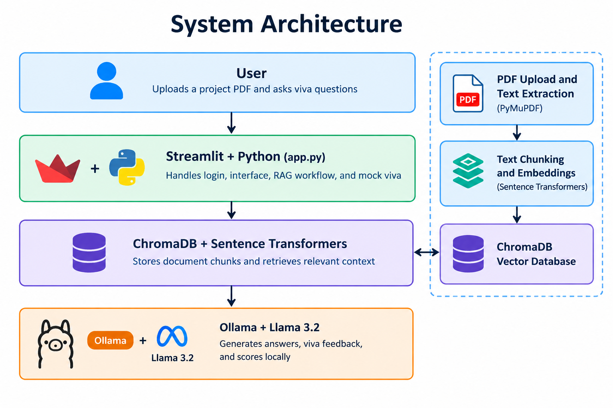

Project Name: Project Intelligence & Viva System
VivaIQ – Viva Intelligence & Question-generation System

1.About the Project

VivaIQ is an AI-powered web application designed to help students prepare for their project viva examinations. Students can upload their project report in PDF format, ask questions about their project, practise mock viva questions, and receive feedback on their answers.

The application uses Retrieval-Augmented Generation (RAG) to retrieve relevant information from uploaded project documents and generate context-aware responses using a Large Language Model (LLM).

2.Features

- User registration and login
- PDF project report upload
- Text extraction from PDF documents
- AI-powered project chatbot
- Context-aware question answering using RAG
- Mock viva question generation
- Answer evaluation and feedback
- Score and report generation
- Downloadable viva reports
- Saved viva history
- Local AI model integration

3.Technology Stack

- Programming Language: Python
- Frontend / Web Framework: Streamlit
- Large Language Model Runtime: Ollama
- AI Model: Llama 3.2 (3B)
- Embedding Model: all-MiniLM-L6-v2
- Vector Database: ChromaDB
- PDF Processing: PyMuPDF
- HTTP Client: Requests
- Data Storage: JSON files and ChromaDB

4.System Architecture

1. The student registers or logs in to the application.
2. The student uploads a project report in PDF format.
3. PyMuPDF extracts text from the uploaded document.
4. The extracted text is divided into smaller chunks.
5. The embedding model converts the chunks into vector embeddings.
6. ChromaDB stores the embeddings and retrieves relevant content.
7. Ollama runs the Llama 3.2 model to generate answers based on the retrieved context.
8. Students can practise mock viva questions and receive feedback.

5.Project Structure

project_intelligence_viva/
│
├── README.md
├── .gitignore
│
└── backend/
    ├── app.py
    ├── main.py
    ├── requirements.txt
    ├── uploads/
    └── chroma_db/
Note: The uploads and chroma_db folders may be created or populated when the application runs. Local user data and generated database files should not be committed to GitHub.

6.System Architecture

7.Prerequisites

Install the following before running the project:

- Python 3.10 or a compatible version
- Git
- Ollama
- Llama 3.2 (3B) model

8.Installation and Setup

1. Clone the Repository
git clone https://github.com/valli0796/project_intelligence_viva.git
cd VivaIQ

2. Navigate to the Backend Folder
cd backend

3. Create a Virtual Environment
python -m venv venv

4. Activate the Virtual Environment
For Windows PowerShell:
.\venv\Scripts\Activate.ps1

5. Install Dependencies
pip install -r requirements.txt

6. Install and Start Ollama
Download Ollama from:
https://ollama.com/
Download the Llama 3.2 (3B) model:ollama pull llama3.2:3b

7. Run the Application
python -m streamlit run app.py

Open the application in your browser:

http://localhost:8501

9.How to Use

1. Register a new account or log in.
2. Upload your project report PDF.
3. Ask project-related questions through the AI chatbot.
4. Start a mock viva session.
5. Submit answers to the generated questions.
6. Review your scores and feedback.
7. Download reports and review saved viva history.

10.Security and Privacy

- Do not commit API keys, passwords, or environment files.
- Do not upload real users' private information to a public repository.
- Local JSON files and database files may contain sensitive data.
- Use appropriate authentication and access controls before making the application available to other users.

11.Current Status

VivaIQ is developed as a local Streamlit web application. The application can be run on a computer with Python, the required dependencies, and Ollama installed.

Uploading the source code to GitHub does not deploy the application to the internet.

12.Future Enhancements

- Online deployment
- Support for additional language models
- Improved viva performance analytics
- Additional document formats
- Enhanced report generation
- Cloud-based database and storage
